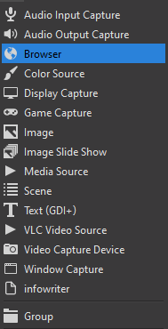
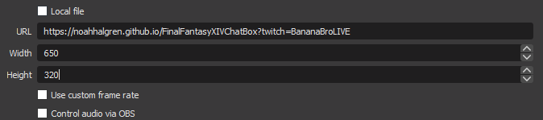
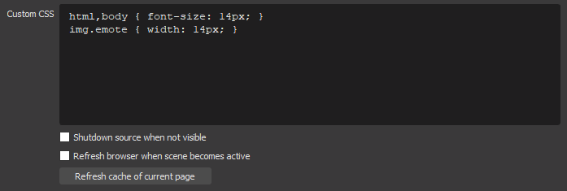
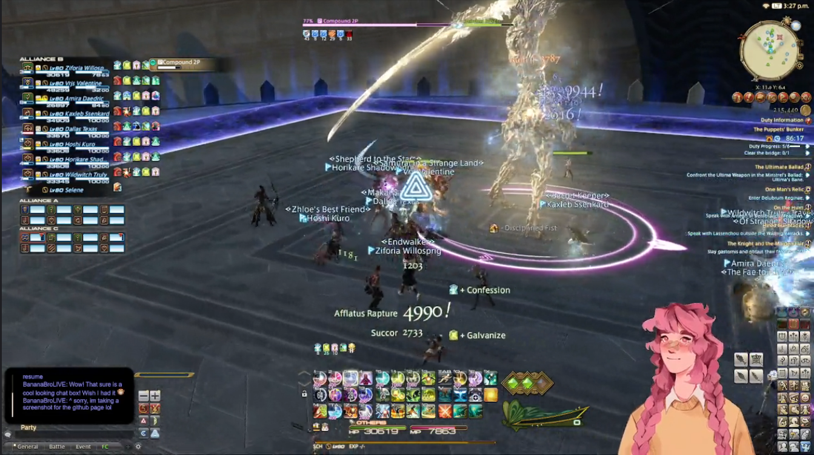
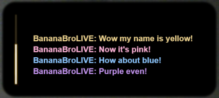
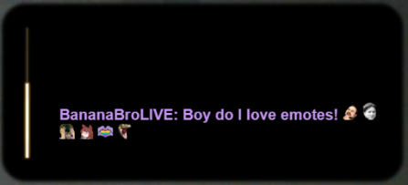
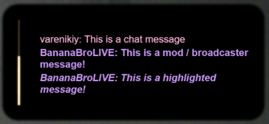

# FinalFantasyXIVChatBox

A twitch chat box modeled after the in-game chat box in Final Fantasy XIV!

The chat box is set up to perfectly mask the in-game chat box, allowing you to show off your own chat on stream while also covering up the in-game chat without breaking the look and feel of FFXIV

## Usage Agreement
All I ask is that you credit me and provide a link back to this page so other streamers can use this chat box as well.

## How to use

Here is a step-by-step process of setting this chat box up for your stream!

1. Create a new Browser source. Name it whatever you'd like.



2. Paste the following link into the URL field of the browser source. **Remember to put your username in the link or this will now work!** Also, set the Width to 650 and the Height to 320.

https://noahhalgren.github.io/FinalFantasyXIVChatBox?twitch=YOUR-TWITCH-USERNAME



3. **VERY IMPORTANT!!** Replace the custom CSS box with the following CSS:

```
html,body { font-size: 14px; }
img.emote { width: 14px; }
```

**If you skip this step, the background will not be transparent**. Additionally, you can modify the text size and emote size by adjusting the px numbers in this field.



4. Ta-Da! Everything should be working now. Happy streaming warriors or light!



*Above screenshot taken from https://www.twitch.tv/varenikiy*
## Features

This chat box was designed to perfectly hide the in-game chat while also showing off your own chat. There are a number of key features to mention!

- Many colors supported! 
The color of a chatter in the chat box will be determined by their selected color on twitch.



- Emotes supported! 
Emotes will apear in the chat box! You can also adjust their size using the custom CSS from step 3 of the setup.



- Highlighted messages supported! 
When a chatter uses channel points to highlight a message it will apear as italicized and bolded! Additionally, moderators and broadcasters will allways apear bolded.



